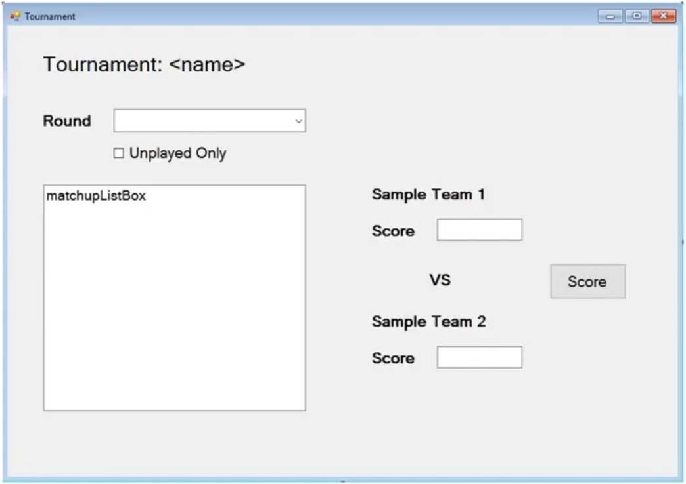
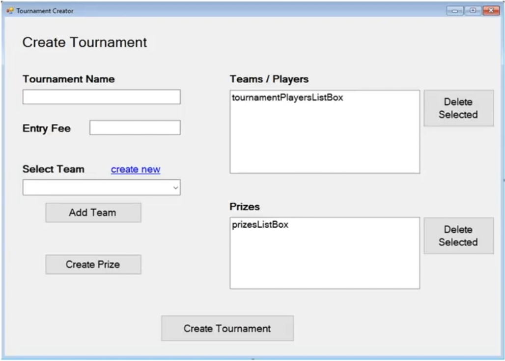
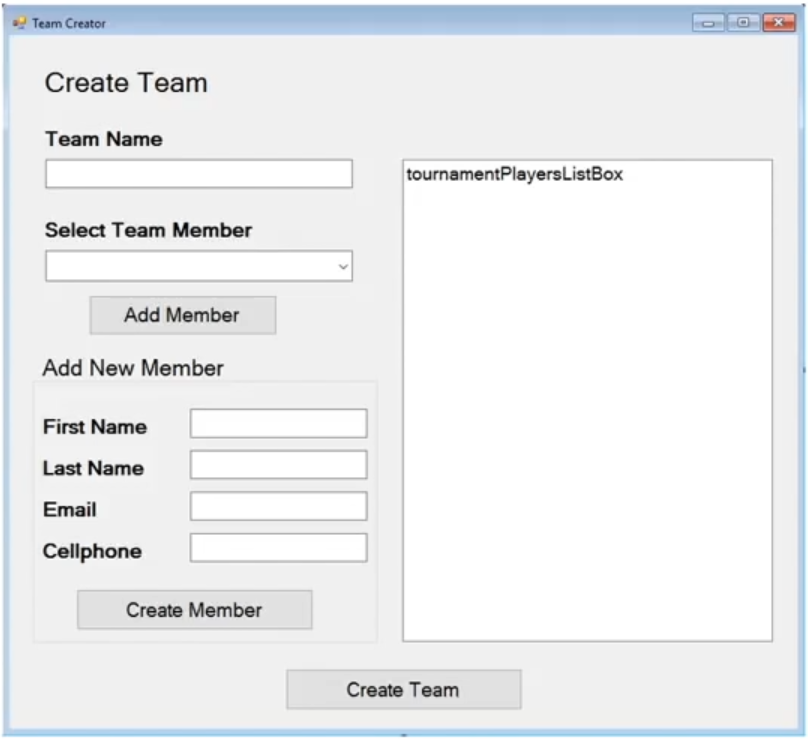
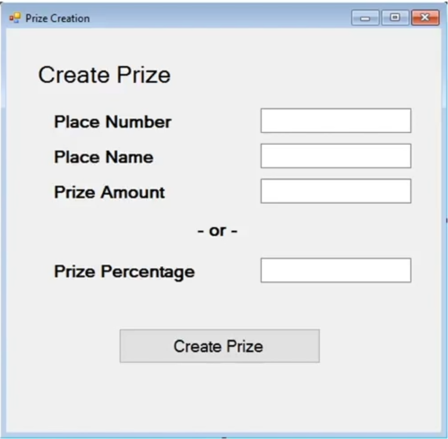
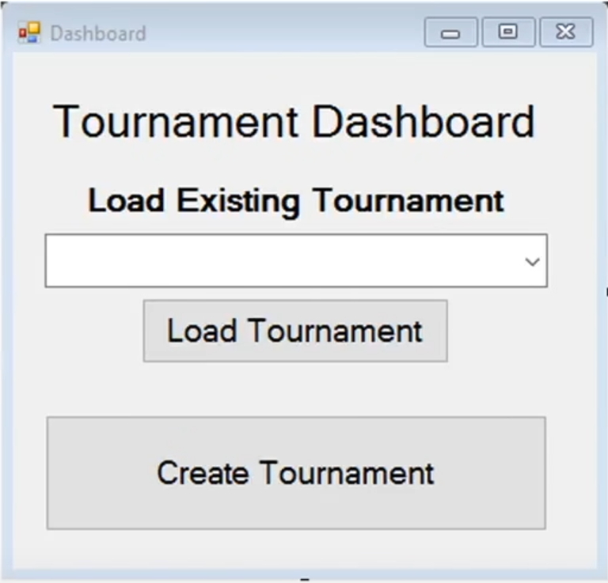

# General Notes

This is a collection of my notes from the video course [Create a C# Application from Start to Finish - Complete Course ](https://www.youtube.com/watch?v=wfWxdh-_k_4).

## Initial requirements list

We should start by listing the requirements for our app. This will look like an NCAA tournament bracket.

1. Tracks games played and their outcome (who won).
1. Multiple competitors play in the tournament.
1. Creates a tournament plan (who plaues in what order).
1. Schedules games.
1. A single loss eliminaters a player.
1. The last player standing is the winner.

### Questions

1. How many players will the tournament handle? Is it variable?
    * Variable number of players.
1. If a tournament has less than the full complement of players, how do we handle it?
    * Should have byes if less than a power of 2
1. Should the orderiung of who plays each order be random or ordered by input order?
    * Random order
1. Should we schedule the game or are they played whenever?
    * Games should be played in whatever order.
1. If the games are scheduled, how does thge system know when to schedule the games for? 
    * They're not. We don't care.
1. If the games are played whenever, can a gamee from a second round be played before the first roud is complete?
    * No, each round must be fully completed before the next round is displayed.
1. Does the system neeed to store a score of some kind or just who won?
    * Storing a sumple score wopuld be nice. Just a number from each plaers. That way we can handle a checkers torunament or a basketball terminal
1. What type of front-end shoudl this syustem have (form, webpage, app, etc)?
    * It should be a desktop system, but might down the road we might want to turn it into an app or website.
1. Where will the data be stored?
    * Ideally in Microsoft SQL database, but put in the option to store in a text file instead.
1. Will this sytstem handle entry fees, prizes, or other payouts?
    * Yes. Should  be an option to charge and entry fee. Prizes should also be an option, where the admin choose how much money to award and a variable number of places. The total cash ammount should not exceed income from the tournament. A percentage-based system would also be nice to specify.
1. What type of reporting is needed?
    * A simple report specifying the outcome of the games per round as well as a report that specifies who won and howmuych they won. These can be just displayed on a form or emailed to the adming and participants.
1. Who can fill in the resutls of a game?
    * Anyone using the applicaiton should be able to fill in the gamee scores.
1. Are there varying levels of access?
    * No. The only method of varied access is if the competitors are not allowed into the app and instead do everything via email.
1. Should this system contact users about upcoming games?
    * Yes, the system should email users that they are due to play in a round as well as who they are scheduled to play.
1. Is each player on their own or can teams use this tournament tracker?
    * The tournament tracker should be able to handle the addition of other members. All members should be treated as equal (all get the emails). They should also be able to name their team.

## Big Picture Design

* Structure:  Windows Forms application and Class Library
* Data: SQL and/or Text file
* Users: One at a time on one application

This locks in some initial boundaries for the design of our application, to prevent us from overstreching ourselves too soon.

### Key concepts

* Email
* SQL
* Custom Events
* Error Handling
* Interfaces
* Random ordering
* Texting

## Data Design

In this course we're sarting out with designing our data structures, and only then moving onto designing the front end.

First list down everything, and only them note down the type for each object. It's also useful do break thing down now and put them together later if needed (e.g. names). It's much harder to break things appart if necessary later.

It's ok to miss stuff. Just do your best to think it through.

### Mapping the Data

#### Team
* TeamMembers `List<Person>`
* TeamName `string`

#### Person
* FirstName `string`
* LastName `string`
* EmailAddress `string`
* CellphoneNumber `string`

#### Tournament
* TournamentName `string`
* EntryFee `decimal` (`decimal` becasue it's money and we need the precision, otherwise `double` might be an option)
* EnteredTeams `List<Team>`
* Prizes `List<Prize>`
* Rounds `List<List<Matchup>>` (one list of matchups per round, one list to contain the lists of rounds)

#### Prize
* PlaceNumber `int`
* PlaceName `string`
* PrizeAmount `decimal`
* PrizePercentage `double` (here we don't need the extra precision)

#### Matchup
* Entries `List<MatchupEntry>`
* Winner `Team`

#### MatchupEntry
* TeamCompeting `Team`
* Score `double`
* ParentMatchup `Matchup`

## User Interface Design

UI designs taken from the video. These should be scketched out in paper or a whiteboard to get the initial designs, so we don't have tot fiddlle around with Forms and we can iterate very rapidly on our design and experiment wiith ideas. 

### Tournament Viewer

### Create Tournament

### Create Team

We're creating team members in the team creator to streamline the process and prevent the user from having to go down multiple levels.

### Create Prize

### Tournament Dashboard

## Logic Planning

Do this on paper or scratch pad and draw out each form and element(button and what write out the logic they perform. The course just dicussed it orally over the form screenshots. Some things are hard to plan out in abstract and are best dealt with in the code itself (e.g. how to set up the different databases).

